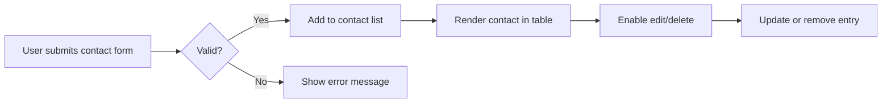

# KeepContact

**KeepContact** is a clean, responsive, and intuitive web application designed to simplify contact management. Whether for personal agendas or professional client tracking, KeepContact offers an elegant solution to store, edit, and manage contacts with ease, from any device, at any time.

<p align="center">
  
</p>

---

## 📱 Why Choose KeepContact?

- **Mobile-first design:** Optimized for smartphones, tablets, and desktops.  
- **Fast and lightweight:** Pure JavaScript ensures smooth performance without relying on heavy frameworks.  
- **No login required:** Instant access to your contact list — no distractions, just function.  
- **Fully editable:** Add, update, or delete contact entries in real-time.  
- **Perfect for freelancers & small teams:** Keep professional or client contacts organized on the go.  

---

## 🛠 Technology Stack

| Layer            | Technology             | Purpose                                         |
|------------------|------------------------|------------------------------------------------|
| Frontend         | HTML5, CSS3, JavaScript| Structure, styling, and client-side logic      |
| UI/UX Design     | Figma                  | Wireframing and interface prototyping          |
| Version Control  | Git & GitHub           | Code management and project tracking           |
| State Management | Vanilla JavaScript     | Dynamic DOM manipulation and data persistence  |

---

## 🔍 Technical Highlights

- **Semantic HTML Structure:** Accessible markup for tables and forms.  
- **Responsive Layout:** CSS Grid and Flexbox used to ensure a seamless experience across screen sizes.  
- **Dynamic DOM Interaction:** Live editing, deletion, and addition of contacts without page reload.  
- **Data Handling:** Contact data handled dynamically through JavaScript objects and local state.  
- **Intuitive UX:** Focused on minimalism and usability with immediate feedback on user actions.  

---

## 🧠 Contact Management Logic (JavaScript Flow)


---
## 🎨 Figma Prototype

<p align="center">  </p> <p align="center"> <strong>Visual Planning:</strong><br> UI/UX prototypes built with Figma to ensure consistent design flow and user experience across all screen sizes. </p>

## 🧑‍💻 Skills Demonstrated and Applied
```
  - Semantic and accessible HTML layout for contact listing.

  - Mobile-first responsive CSS using modern Flexbox and Grid.

  - Modular JavaScript with functions for:
    - Real-time DOM updates (Add/Edit/Delete)
    - Dynamic rendering of contact rows
    - Form validation to ensure clean data input

  - UX/UI design execution based on Figma prototypes.

  - Git-based version control and project documentation.
```
---

⚡ Getting Started
Clone this repository:
```
git clone https://github.com/yourusername/KeepContact.git
```
Open `index.html` in your browser.

Start adding contacts and experience fast, distraction-free contact management.

## 🚀 Organize Your Contacts Effortlessly with KeepContact

Eliminate clutter, centralize your contact list, and bring structure to your personal or professional relationships. All through an elegant, fast, and responsive web app.
---
Tech Stack: `JavaScript`, `HTML`, `CSS`.
